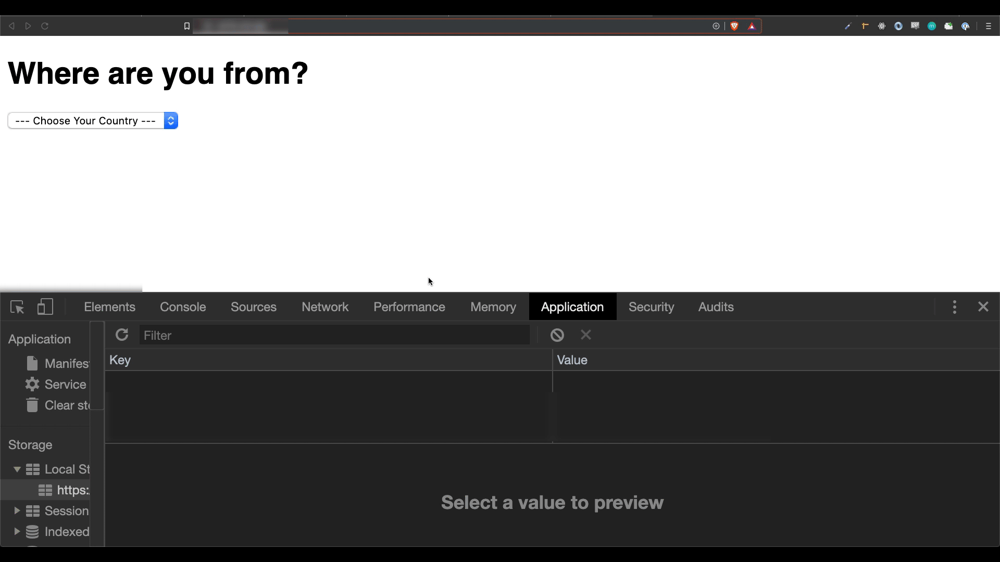

## Languages

## Conditions for Challenges

✅ Save the country selection to localStorage  
✅ Load the saved selection on refresh

## Clues

<ul>
<li>Don't forget to add 'values' to the options.</li>
<li>You need to 'select' the option that has the same value as the localStorage.</li>
  <li><a href="https://developer.mozilla.org/ko/docs/Web/API/HTMLElement/change_event">< select ></a></li>
  <li><a href="https://developer.mozilla.org/ko/docs/Web/HTML/Element/option">< option ></a></li>
<li><a href="https://developer.mozilla.org/ko/docs/Web/API/Document/querySelector">.querySelector()</a> (Check out the section: 좀 더 복잡한 선택자)</li>
</ul>

## Result

